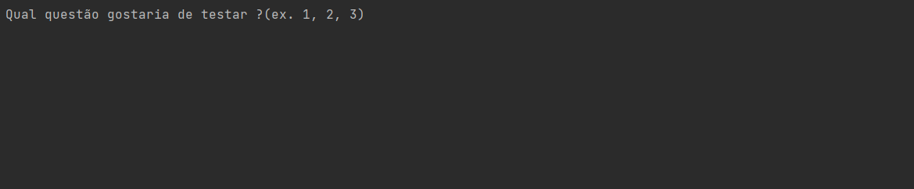
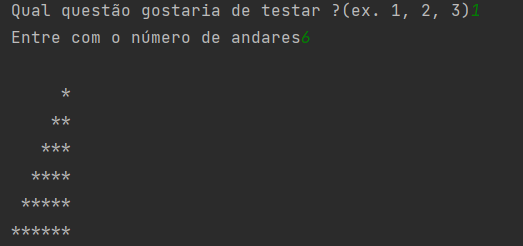

# Desafio de Programação
 Este é um desafio de programação realizado pela Academia Capgemini

> Esta resposta foi escrita em Java usando o intellij idea, todas as respostas se encontram na classe "Main", para acessar cada resposta é necessário colocar o seu número correspondente (1,2 ou 3).
> 
> 
> 

## 💻 Requisitos

* Para roda este arquivo você precisa de JDK.

## 📝 licença

Este projeto não têm uma licença ! use-o como quiser !

